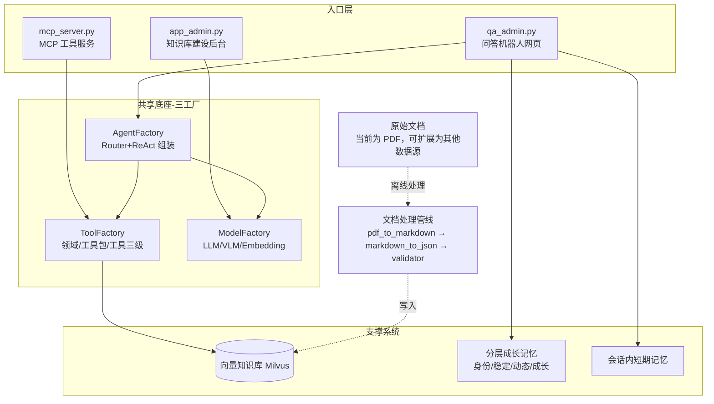

# agent_jerry_gao

一套围绕**三工厂底座**构建的 FineBI 智能问答系统：`ModelFactory`（模型与算力）、`ToolFactory`（分级工具）、`AgentFactory`（路由 + ReAct Agent 组装）作为共享基础设施，支撑起三个复用它们的入口程序——知识库建设后台、问答机器人网页、对外 MCP 工具服务。系统内嵌了一条内容无关的 RAG 入库管线（当前以 PDF 解析为起点验证，向量库本身可承载任意数据源），以及一套不只是记录聊天、而是追踪用户能力/目标/状态**成长轨迹**的分层记忆体，并配有代码沙箱执行与内容合规双重安全防护。

> 本 README 由阅读源码整理而成（仓库原 README 为空）。项目内多个模块处于迭代/重构状态（同一功能存在多个版本文件，部分模块整段被注释保留作为历史版本），使用前请对照当前代码确认实际启用的实现。

## 系统设计优势

- **三工厂解耦，一套底座支撑三个入口**：`ModelFactory` 统一管理 LLM/VLM/Embedding 的加载与显卡分配，`ToolFactory` 提供领域→工具包→工具的三级注册体系，`AgentFactory` 在此之上组装路由与推理 Agent。三者被 `app_admin.py`（建库）、`qa_admin.py`（问答网页）、`mcp_server.py`（MCP 工具服务）共同复用，避免了模型重复加载和工具重复实现。
- **建库与问答解耦**：文档解析（VLM）→ Markdown → JSON 分块 → 校验 → 写入 Milvus 是一条独立的离线管线，问答机器人只负责检索与生成，两者可以分别迭代、分别扩容。PDF 只是当前落地的第一种数据源（也是最初用于验证管线的起点），向量库本身不绑定 PDF——任何能整理成文本分块的内容（网页、Word、数据库导出、API 返回等）都可以走同一条入库路径，只需替换 `data_prep/` 里的解析环节。
- **工具能力可对外复用**：`ToolFactory` 里注册的工具（如知识库检索）不仅供内部 `ReActAgent` 调用，还通过 `mcp_server.py` 原样暴露给外部 Agent，同一套能力两处复用。
- **记忆体追踪的是轨迹而非流水账**：`memory_growth` 把用户信息拆成身份（无轨迹，单独存 profile）、稳定语境（长期目标/能力树）、动态语境（当前偏好/卡点）、成长语境（前三层如何随时间演变）四层，渲染为 Prompt 注入 Agent——做到的是"共同成长"式的持续认知积累，而不只是更大的聊天记录库。这与会话内的短期记忆（`memory/`）是互补的两个时间尺度。
- **双重安全防护，分而治之**：代码类工具调用走 AST 静态审查 + 子进程沙箱隔离；文本类输入输出走正则脱敏 + LLM 语义二次审查。两条链路共用 `config/patterns.yaml` 规则源，但审查对象和执行方式完全独立，互不影响。

## 系统架构



三个入口共享同一套三工厂底座，底座之下再连接向量知识库（供检索）与分层成长记忆（供跨会话用户认知）两大支撑系统；安全防护（AST 审查+沙箱、正则脱敏+LLM 语义审查）贯穿代码执行与文本内容两条链路，未在图中单独画出但作用于 Agent 输出的每一环。

## 目录结构与模块职责

| 目录/文件 | 职责 |
|---|---|
| `app_admin.py` | 知识库管理后台（Gradio）：配置文档处理与入库参数（目前主体被注释，处于重构中） |
| `qa_admin.py` | 问答系统主后台（Gradio）：加载模型、检索器、Agent、记忆与合规模块，提供带用户鉴权的问答界面 |
| `mcp_server.py` | 基于 FastMCP 将内部工具（如知识库检索、仪表板查询）暴露为 MCP Tool，供外部 Agent 调用 |
| `data_prep/pdf_to_markdown.py` | 使用 VLM（多模态模型）解析 PDF 版面与图片，输出 Markdown |
| `data_prep/markdown_to_json.py` | 按标题分块 Markdown，产出带元数据的 JSON chunk |
| `ingest/validator.py` | 写入前的数据校验（字段完整性、长度、结构） |
| `ingest/db_uploader.py` | 连接 Milvus，写入向量与元数据，并做检索验证 |
| `search/retriever.py` | 基于 `MilvusClient` 的向量/关键词混合检索 |
| `search/reranker.py` | 交叉编码器重排序，按概率阈值与得分差过滤结果 |
| `factory/model_factory.py` | 全局模型与算力工厂：统一管理 LLM/VLM/Embedding 模型的加载、显卡分配与生命周期 |
| `factory/tool_factory.py` / `factory/tool_registry.py` | 三级（领域/工具包/工具）分级工具工厂与具体工具注册 |
| `factory/agent_factory.py` | `RouterAgent`（意图路由到业务领域）与 `ReActAgent` 的组装入口 |
| `generator/llm_client.py` / `generator/qa_chain.py` | 面向业务的推理客户端与端到端问答链（检索→重排→生成） |
| `agent/react_agent.py` | 两阶段分级路由 + 动态 Prompt 绑定的 ReAct Agent 实现 |
| `agent/react_agent_integrated.py` | 接入沙箱与事务型 Memory 的强约束版本 ReAct Agent |
| `agent/security.py` | 基于 AST 的代码静态安全审查（导入/调用/属性白名单与黑名单） |
| `agent/sandbox.py` | 子进程隔离执行受限代码，配合 `security.py` 做二次防护 |
| `agent/compliance.py` | 双重合规引擎：正则脱敏 + LLM 语义二次审查 |
| `memory/` | 会话级记忆：短期消息窗口（`short_term_memory.py`）、实体抽取（`entity_memory.py`）、JSON 文件持久化（`chat_history_file.py`），由 `memory_manager.py` 统一编排并支持事务快照 |
| `memory_growth/` | 跨会话“成长型语境”系统：`extractor.py` 从历史会话抽取事实 → `layer_mapper.py` 映射进三层语境 schema → `context_builder.py` 渲染为 11 模块的 System Context |
| `config/` | `prompt_hub.yaml`（Prompt 模板中心）、`patterns.yaml`（合规/安全正则规则）、`users_auth.yaml` 与按用户的个性化规则 |

## 快速开始

```bash
git clone https://github.com/jerrygao0204/agent_jerry_gao.git
cd agent_jerry_gao
```

依赖通过各脚本内的 `install_package()` 在运行时自动 `pip install`（当前仓库未附带 `requirements.txt`），核心依赖包括：`transformers`、`torch`、`pymilvus`、`gradio`、`fastmcp`、`langchain_text_splitters`、`pydantic`、`PyMuPDF` 等。

1. **准备向量库**：启动 Milvus（默认连接 `172.17.0.1:19530`，集合名 `finebi_knowledge_chunks`）。
2. **离线入库**：运行 `data_prep/pdf_to_markdown.py` → `data_prep/markdown_to_json.py`，将文档（当前实现以 PDF 手册为例，是最初用于验证管线的数据源）解析、分块并经 `ingest/validator.py` 校验后由 `ingest/db_uploader.py` 写入 Milvus；换成其他数据源时只需替换解析这一步的输出，后续分块/校验/入库环节可复用。
3. **启动问答服务**：运行 `qa_admin.py`（Gradio 界面，读取 `config/users_auth.yaml` 做用户鉴权）。
4. **（可选）暴露 MCP 工具**：运行 `mcp_server.py`，供外部 Agent 通过 MCP 协议调用知识库检索等工具。

## 记忆与安全机制详解

### 成长型记忆系统 (memory_growth)：追踪轨迹，而不只是记录

与 `memory/` 的会话内短期记忆不同，`memory_growth/` 负责跨会话的长期用户认知积累，核心设计是把用户信息按**能否体现变化轨迹**分层，而不是一股脑塞进同一个结构：

- **身份画像**（`identity_facts`：姓名、职业、所在城市等）——没有轨迹可言，单独存一份 profile，不进成长结构
- **稳定语境** ——长期目标、能力树，变化慢
- **动态语境** ——当前偏好、卡点、正在做的技术迁移，变化快
- **成长语境** ——记录前三层本身是如何随时间演变的，这是"成长"二字的落点

处理链路：

1. **历史会话** `data/<user_id>/session_*.json`
2. **事实抽取** `extractor.py` 的 `FactExtractor` 从会话中抽取事实，并把抽取水位线 `last_run_at` 记在 `facts.json` 的 `metadata` 字段里，避免重复处理
3. **四层语境映射** `layer_mapper.py` 将扁平事实映射进标准 schema（`user_profile` 静态画像 + 三层动态语境），写入 `layered_context.json`，支持增量合并与去重
4. **语境渲染** `context_builder.py` 按 11 个模块做防御性渲染（处理空字段、字典列表、字符串列表等），产出 `user_prompt_context.txt`，最终被 `QAChain` 注入到系统提示词中，让 Agent 具备跨会话的持续用户认知
5. 路径统一由 `path_config.py` 的 `UserMemoryPathConfig` 管理，支持多用户隔离

### Agent 安全防护：沙箱执行 + 内容合规

系统对「代码」和「文本」分别设置了独立的防护链路：

- **代码执行安全**（`agent/security.py` + `agent/sandbox.py`）：ReAct Agent 生成的代码工具调用先经 `ASTCodeChecker` 基于抽象语法树做静态审查（依据 `config/patterns.yaml` 中的导入/调用/属性白名单与黑名单过滤），通过后交给 `SandboxExecutor` 在独立子进程中执行，并施加超时控制，防止逃逸或长时间占用资源。
- **内容合规审计**（`agent/compliance.py`）：用户输入与模型输出文本会经过 `ComplianceChecker` 的双重审计——先用 `patterns.yaml` 中的正则规则做敏感信息脱敏，再触发一次 LLM 语义审查，判断是否放行或改用预设的兜底话术回复。

两条链路共用 `config/patterns.yaml` 作为规则来源，但审查对象和执行方式完全独立。

## 需要注意的现状

- **硬编码路径**：多处默认路径指向 `/workspace/hf-conda/RAG/问答机器人/...`（如 `memory/chat_history_file.py`、`memory_growth/path_config.py`），迁移环境时需要替换。
- **在演/在重构文件**：`app_admin.py`、`agent/react_agent_integrated.py`、`factory/tool_registry.py`、`generator/qa_chain.py` 等文件中存在整段注释掉的历史实现，与当前生效代码并存，阅读时需以未注释部分为准。
- **无依赖清单**：建议后续补充 `requirements.txt` / `pyproject.toml` 固化依赖版本。
- **存储引擎为测试态**：`memory/chat_history_file.py` 当前使用 JSON 文件存储对话历史，注释中说明后续可替换为数据库存储。
