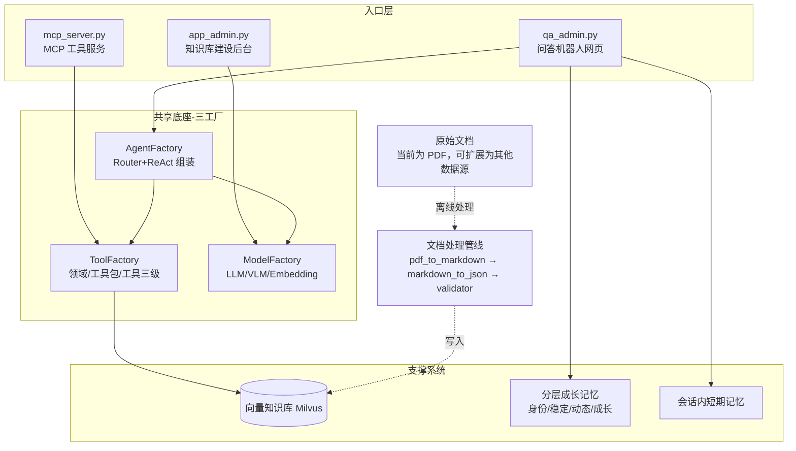

# Growlong

一套围绕**三工厂底座**构建的智能问答系统：`ModelFactory`（模型与算力）、`ToolFactory`（分级工具）、`AgentFactory`（路由 + ReAct Agent 组装）作为共享基础设施，支撑起三个复用它们的入口程序——知识库建设后台、问答机器人网页、对外 MCP 工具服务。系统内嵌了一条内容无关的 RAG 入库管线（当前以 PDF 解析为起点验证，向量库本身可承载任意数据源），以及一套不只是记录聊天、而是追踪用户能力/目标/状态**成长轨迹**的分层记忆体，并配有代码沙箱执行与内容合规双重安全防护。

## 系统设计优势

- **三工厂解耦，一套底座支撑三个入口**：`ModelFactory` 统一管理 LLM/VLM/Embedding 的加载与显卡分配，`ToolFactory` 提供领域→工具包→工具的三级注册体系，`AgentFactory` 在此之上组装路由与推理 Agent。三者被 `app_admin.py`（建库）、`qa_admin.py`（问答网页）、`mcp_server.py`（MCP 工具服务）共同复用，避免了模型重复加载和工具重复实现。
- **建库与问答解耦**：文档解析（VLM）→ Markdown → JSON 分块 → 校验 → 写入 Milvus 是一条独立的离线管线，问答机器人只负责检索与生成，两者可以分别迭代、分别扩容。PDF 只是当前落地的第一种数据源（也是最初用于验证管线的起点），向量库本身不绑定 PDF——任何能整理成文本分块的内容（网页、Word、数据库导出、API 返回等）都可以走同一条入库路径，只需替换 `data_prep/` 里的解析环节。
- **自研滑动窗口解析长 PDF**：`pdf_to_markdown.py` 没有直接把整份 PDF 丢给 VLM，而是用自研的滑动窗口机制分片识别，解决了长文档超出模型单次处理能力的问题；同时通过跨窗口的表格合并逻辑，修复了表格跨页断裂、无法被正确识别为同一张表的问题。
- **工具能力可对外复用**：`ToolFactory` 里注册的工具（如知识库检索）不仅供内部 `ReActAgent` 调用，还通过 `mcp_server.py` 原样暴露给外部 Agent，同一套能力两处复用。
- **记忆体追踪的是轨迹而非流水账**：`memory_growth` 把用户信息拆成身份（无轨迹，单独存 profile）、稳定语境（长期目标/能力树）、动态语境（当前偏好/卡点）、成长语境（前三层如何随时间演变）四层，渲染为 Prompt 注入 Agent——做到的是"共同成长"式的持续认知积累，而不只是更大的聊天记录库。这与会话内的短期记忆（`memory/`）是互补的两个时间尺度。
- **双重安全防护，分而治之**：代码类工具调用走 AST 静态审查 + 子进程沙箱隔离；文本类输入输出走正则脱敏 + LLM 语义二次审查。两条链路共用 `config/patterns.yaml` 规则源，但审查对象和执行方式完全独立，互不影响。
- **工具级权限控制**：`config/tools.yaml` 支持按 domain/工具粒度配置 `role_whitelist`，不同角色（`admin`/`analyst`/`user`）能看到的工具域不同，避免普通用户误触高危元数据类工具。
- **用户反馈闭环 + 运行观测**：`memory/feedback_store.py` 记录每次回答的 👍/👎 反馈，`api/observability.py` 定期聚合查询量、compliance 拦截率等基础运行指标。

## 系统架构



三个入口共享同一套三工厂底座，底座之下再连接向量知识库（供检索）与分层成长记忆（供跨会话用户认知）两大支撑系统；安全防护（AST 审查+沙箱、正则脱敏+LLM 语义审查）贯穿代码执行与文本内容两条链路，未在图中单独画出但作用于 Agent 输出的每一环。

## 目录樹

```bash
agent_jerry_gao/
├── README.md
├── Requirements.txt
├── app_admin.py
├── qa_admin.py
├── mcp_server.py
├── api/
│   └── observability.py
├── agent/
│   ├── compliance.py
│   ├── react_agent.py
│   ├── react_agent_integrated.py
│   ├── sandbox.py
│   └── tool_transport.py
├── config/
│   ├── config_loader.py
│   ├── patterns.yaml
│   ├── prompt_hub.yaml
│   └── users_auth.yaml
├── data/
│   └── <user_id>/
│       ├── session_*.json
│       └── sessions_index.json
├── data_prep/
│   ├── markdown_to_json.py
│   └── pdf_to_markdown.py
├── eval/
│   ├── eval_dataset.json
│   ├── eval_generator.py
│   ├── eval_retriever.py
│   ├── reports/
│   └── run_all_eval.py
├── factory/
│   ├── agent_factory.py
│   ├── model_factory.py
│   ├── tool_factory.py
│   ├── tool_registry.py
│   └── tools/
│       ├── __init__.py
│       ├── api_tool.py
│       ├── base_tool.py
│       ├── rag_tool.py
│       └── web_search_tool.py
│       └── ...
├── generator/
│   ├── llm_client.py
│   └── qa_chain.py
├── ingest/
│   ├── db_uploader.py
│   └── validator.py
├── memory/
│   ├── chat_history_file.py
│   ├── entity_memory.py
│   ├── feedback_store.py
│   ├── memory_manager.py
│   └── short_term_memory.py
├── memory_growth/
│   ├── atomic_io.py
│   ├── context/
│   │   └── users/
│   │       └── <user_id>/
│   │           ├── facts.json
│   │           ├── layered_context.json
│   │           └── user_prompt_context.txt
│   ├── context_builder.py
│   ├── extractor.py
│   ├── layer_mapper.py
│   └── path_config.py
├── search/
│   ├── reranker.py
│   └── retriever.py
├── tests/
│   ├── conftest.py
│   └── ...
├── tool幫助文檔.md
└── tool創建文檔.md
```
## 目录结构与模块职责

### 1) 入口层 / 应用层

| 目录/文件 | 职责 |
|---|---|
| `app_admin.py` | 知识库建设后台（Gradio）：负责文档解析、清洗、分块、校验与入库流程的管理入口 |
| `qa_admin.py` | 问答系统主后台（Gradio）：负责检索增强问答、记忆注入、合规审计、沙箱执行与用户鉴权 |
| `mcp_server.py` | 对外 MCP 工具服务入口：将内部工具能力暴露给外部 Agent |
| `api/observability.py` | 轻量级可观测性扫描：统计会话数、用户数、查询数、合规拦截数等指标 |

### 2) 文档处理与入库管线

| 目录/文件 | 职责 |
|---|---|
| `data_prep/pdf_to_markdown.py` | 使用 VLM 解析 PDF 为 Markdown，支持长文档滑动窗口识别与跨页表格合并 |
| `data_prep/markdown_to_json.py` | 将 Markdown 按标题/层级切分成结构化 JSON chunk |
| `ingest/validator.py` | 入库前校验：检查字段完整性、长度、结构合法性等 |
| `ingest/db_uploader.py` | 将向量和元数据写入 Milvus，并执行基础检索验证 |

### 3) 检索与生成链路

| 目录/文件 | 职责 |
|---|---|
| `search/retriever.py` | 基于 Milvus 的向量/关键词混合检索器 |
| `search/reranker.py` | 交叉编码器重排序模块，对候选结果做相关性过滤和排序 |
| `generator/llm_client.py` | 对底层 LLM 推理调用的统一封装 |
| `generator/qa_chain.py` | 端到端问答链：检索 → 重排 → 生成，并集成合规与超时控制 |

### 4) 三工厂底座

| 目录/文件 | 职责 |
|---|---|
| `factory/model_factory.py` | 模型与算力工厂：统一管理 LLM / VLM / Embedding 的加载和显卡分配 |
| `factory/tool_factory.py` | 工具工厂：按领域、工具包、工具三级管理工具注册与元数据导出 |
| `factory/tool_registry.py` | 工具注册初始化：从配置或具体实现模块加载工具到工厂体系 |
| `factory/agent_factory.py` | Agent 组装入口：将路由器、ReAct Agent、工具、模型组合为完整工作流 |
| `factory/tools/__init__.py` | 工具包导出入口，统一暴露可注册工具类 |
| `factory/tools/base_tool.py` | 工具基类：定义统一的工具接口与元数据规范 |
| `factory/tools/rag_tool.py` | 知识库检索工具：封装 RAG 检索能力供 Agent/MCP 调用 |
| `factory/tools/api_tool.py` | 仪表板/业务接口工具：封装外部 API 或内部看板查询能力 |
| `factory/tools/web_search_tool.py` | Web 搜索工具：用于补充外部互联网信息检索 |

### 5) Agent 层

| 目录/文件 | 职责 |
|---|---|
| `agent/react_agent.py` | ReAct Agent 主实现：两阶段路由、动态 Prompt 绑定、工具调用与推理循环 |
| `agent/react_agent_integrated.py` | 强约束版 ReAct Agent：集成沙箱与事务型 Memory |
| `agent/security.py` | AST 代码静态审查：限制危险导入、危险调用和属性访问 |
| `agent/sandbox.py` | 子进程隔离执行受限代码，增强工具调用安全性 |
| `agent/compliance.py` | 内容合规模块：正则脱敏 + LLM 语义二次审查 |
| `agent/tool_transport.py` | Agent 与工具之间的调度/转发层，负责工具调用传输 |

### 6) 会话记忆层

| 目录/文件 | 职责 |
|---|---|
| `memory/memory_manager.py` | 会话级记忆总控，统一编排短期记忆、实体记忆与历史存储 |
| `memory/short_term_memory.py` | 短期上下文窗口，用于当前对话轮次记忆 |
| `memory/entity_memory.py` | 实体抽取与实体级上下文维护 |
| `memory/chat_history_file.py` | JSON 文件形式的会话历史持久化 |
| `memory/feedback_store.py` | 用户反馈收集与存储 |

### 7) 成长型记忆层

| 目录/文件 | 职责 |
|---|---|
| `memory_growth/extractor.py` | 从历史会话中抽取事实，生成结构化成长记忆素材 |
| `memory_growth/layer_mapper.py` | 将抽取事实映射到分层语境 schema |
| `memory_growth/context_builder.py` | 将分层语境渲染成 Prompt 可直接注入的系统上下文 |
| `memory_growth/path_config.py` | 用户记忆路径配置与隔离管理 |
| `memory_growth/atomic_io.py` | 原子写入与文件锁辅助工具 |
| `memory_growth/context/` | 成长型语境落盘目录 |
| `memory_growth/context/users/` | 按用户隔离的成长语境数据目录 |
| `memory_growth/context/users/<user_id>/facts.json` | 事实抽取结果 |
| `memory_growth/context/users/<user_id>/layered_context.json` | 分层语境结构化结果 |
| `memory_growth/context/users/<user_id>/user_prompt_context.txt` | 渲染后的最终 Prompt 上下文 |

### 8) 配置层

| 目录/文件 | 职责 |
|---|---|
| `config/prompt_hub.yaml` | Prompt 模板中心 |
| `config/patterns.yaml` | 合规与安全正则规则 |
| `config/users_auth.yaml` | 用户鉴权配置 |
| `config/` 下其他 YAML | 用户个性化规则或运行参数配置 |

### 9) 测试与评估

| 目录/文件 | 职责 |
|---|---|
| `tests/conftest.py` | pytest 公共测试配置，负责把项目根目录加入 `sys.path` |
| `tests/` 下其他测试文件 | 单元测试与集成测试入口，覆盖核心模块行为 |
| `eval/eval_retriever.py` | 检索器评估脚本：测试召回、MRR、延迟等指标 |
| `eval/eval_generator.py` | 生成质量评估脚本：使用 LLM-as-a-Judge 评估回答质量 |
| `eval/run_all_eval.py` | 一键执行检索 + 生成评估的总入口 |
| `eval/eval_dataset.json` | 评测样本数据集 |
| `eval/reports/` | 评测结果导出目录，包含 JSON/Markdown 报告 |

### 10) 文档与辅助说明

| 目录/文件 | 职责 |
|---|---|
| `README.md` | 项目总说明文档与架构说明 |
| `Requirements.txt` | 依赖清单 |
| `tool幫助文檔.md` | 工具开发流程、注册机制、目录规范说明 |
| `tool創建文檔.md` | 工具创建示例与实现规范 |

## 实际系统主线

如果按“运行主链路”看，这个仓库可以理解为：

### 1) 文档入库链路
`app_admin.py` → `config/config_loader.py` → `factory/model_factory.py` → `data_prep/pdf_to_markdown.py` → `data_prep/markdown_to_json.py` → `ingest/validator.py` → `ingest/db_uploader.py` → `search/retriever.py` → `search/reranker.py` → `factory/tool_factory.py` → `factory/tool_registry.py` → `Milvus`

### 2) 问答链路
`qa_admin.py` → `factory/model_factory.py` → `factory/tool_factory.py` → `factory/tool_registry.py` → `generator/llm_client.py` → `generator/qa_chain.py` → `search/retriever.py` → `search/reranker.py` → `agent/react_agent.py` / `agent/react_agent_integrated.py` → `agent/sandbox.py` → `agent/security.py` → `agent/compliance.py` → `memory/memory_manager.py` → `memory/short_term_memory.py` → `memory/entity_memory.py` → `memory/chat_history_file.py` → `memory/feedback_store.py`

### 3) 外部工具服务链路
`mcp_server.py` → `factory/tool_factory.py` → `factory/tool_registry.py` → `factory/tools/__init__.py` → `factory/tools/base_tool.py` → `factory/tools/rag_tool.py` / `factory/tools/api_tool.py` / `factory/tools/web_search_tool.py` → 对外暴露工具能力

### 4) 长期成长记忆链路
`memory_growth/extractor.py` → `memory_growth/layer_mapper.py` → `memory_growth/context_builder.py` → `memory_growth/path_config.py` → `memory_growth/atomic_io.py` → `data/<user_id>/session_*.json` → `memory_growth/context/users/<user_id>/facts.json` → `memory_growth/context/users/<user_id>/layered_context.json` → `memory_growth/context/users/<user_id>/user_prompt_context.txt` → 注入 `generator/qa_chain.py` / `qa_admin.py` 的系统 Prompt

### 5) 可观测性与评测链路
`api/observability.py` → 扫描 `data/` 下的会话文件；  
`eval/eval_retriever.py` → `search/retriever.py` / `search/reranker.py`；  
`eval/eval_generator.py` → `generator/qa_chain.py` / `generator/llm_client.py`；  
`eval/run_all_eval.py` → 串联检索评测与生成评测并输出报告

### 6) 配置与规则链路
`config/prompt_hub.yaml` → 提供 Prompt 模板；  
`config/patterns.yaml` → 提供合规/安全规则；  
`config/users_auth.yaml` → 提供用户鉴权；  
这些配置被 `qa_admin.py`、`agent/compliance.py`、`agent/security.py`、`memory_growth/` 等模块共同使用

### 7) 工程支撑链路
`tests/conftest.py` → 为 `tests/` 下所有测试注入项目根路径；  
`README.md` / `tool幫助文檔.md` / `tool創建文檔.md` → 提供使用说明、工具编写说明和架构文档；  
`Requirements.txt` → 记录仓库依赖

## 使用说明

### 1) 环境准备

```
git clone https://github.com/jerrygao0204/agent_jerry_gao.git
cd agent_jerry_gao
```

仓库依赖通过脚本内的 `install_package()` 自动安装，若你希望手动安装，可参考 `Requirements.txt`。

* * *

### 2) 启动服务

#### 启动知识库建设后台

```
python app_admin.py
```

#### 启动问答系统后台

```
python qa_admin.py
```

#### 启动 MCP 工具服务

```
python mcp_server.py
```

* * *

### 3) 数据处理

#### PDF 转 Markdown

```
python data_prep/pdf_to_markdown.py
```

#### Markdown 转 JSON

```
python data_prep/markdown_to_json.py
```

#### 说明

+   这一流程通常由 `app_admin.py` 串联管理
+   `pdf_to_markdown.py` 负责把原始 PDF 转为 Markdown
+   `markdown_to_json.py` 负责把 Markdown 按标题分块为结构化 JSON

* * *

### 4) 运行测试

测试目录为 `tests/`，使用 `pytest` 运行。

#### 安装 pytest

```
pip install pytest
```

#### 执行全部测试

```
pytest
```

#### 执行指定测试文件

```
pytest tests/test_xxx.py
```

#### 执行指定测试用例

```
pytest tests/test_xxx.py::test_case_name
```

#### 说明

+   `tests/conftest.py` 会自动把项目根目录加入 `sys.path`
+   因此测试中可以直接导入项目内模块，例如：
    +   `from agent.compliance import ComplianceChecker`
    +   `from search.retriever import FineBIRetriever`
    +   `from factory.tool_factory import tool_factory`

* * *

### 5) 运行评测

评测目录为 `eval/`，主要包含检索评测、生成评测和总评测入口。

#### 运行检索评测

```
python eval/eval_retriever.py
```

#### 运行生成评测

```
python eval/eval_generator.py
```

#### 运行全链路评测

```
python eval/run_all_eval.py
```

#### 评测说明

+   `eval/eval_dataset.json` 是评测数据集
+   评测结果会输出到 `eval/reports/`
+   检索评测主要关注：
    +   Hit Rate
    +   MRR
    +   检索延迟
+   生成评测主要关注：
    +   Faithfulness
    +   Answer Relevance
    +   TTFT
    +   生成总延迟

* * *

### 6) 成长型记忆处理

#### 抽取历史事实

```
python memory_growth/extractor.py
```

#### 构建分层语境

```
python memory_growth/layer_mapper.py
python memory_growth/context_builder.py
```

#### 说明

+   `memory_growth/context/users/<user_id>/` 下会生成：
    +   `facts.json`
    +   `layered_context.json`
    +   `user_prompt_context.txt`
+   这些内容会被注入到问答系统的 Prompt 中，用于跨会话长期记忆

* * *

### 7) 使用建议

+   首次运行前，确认 `config/users_auth.yaml`、`config/patterns.yaml`、`config/prompt_hub.yaml` 已正确配置
+   如果路径包含硬编码项，记得根据实际部署环境调整
+   如果只想验证单元能力，优先运行 `tests/`
+   如果想验证整体效果，优先运行 `eval/run_all_eval.py`

## 记忆与安全机制详解

### 成长型记忆系统 (memory_growth)：追踪轨迹，而不只是记录

与 `memory/` 的会话内短期记忆不同，`memory_growth/` 负责跨会话的长期用户认知积累，核心设计是把用户信息按**能否体现变化轨迹**分层，而不是一股脑塞进同一个结构：

- **身份画像**（`identity_facts`：姓名、职业、所在城市等）——没有轨迹可言，单独存一份 profile，不进成长结构
- **稳定语境** ——长期目标、能力树，变化慢
- **动态语境** ——当前偏好、卡点、正在做的技术迁移，变化快
- **成长语境** ——记录前三层本身是如何随时间演变的，这是"成长"二字的落点

处理链路：

1. **历史会话** `data/<user_id>/session_*.json`
2. **事实抽取** `extractor.py` 的 `FactExtractor` 从会话中抽取事实，并把抽取水位线 `last_run_at` 记在 `facts.json` 的 `metadata` 字段里，避免重复处理；读取-抽取-写入整个流程通过 `atomic_io.py` 的 `file_lock_for` 加锁，写入用 `atomic_dump_json` 原子替换，避免并发运行或崩溃导致数据丢失/损坏
3. **四层语境映射** `layer_mapper.py` 将扁平事实映射进标准 schema（`user_profile` 静态画像 + 三层动态语境），写入 `layered_context.json`，支持增量合并与去重，同样接入了加锁+原子写
4. **语境渲染** `context_builder.py` 按 11 个模块做防御性渲染（处理空字段、字典列表、字符串列表等），产出 `user_prompt_context.txt`，最终被 `QAChain` 注入到系统提示词中，让 Agent 具备跨会话的持续用户认知
5. 路径统一由 `memory_growth/path_config.py` 与 `config/` 中的配置共同管理，支持按用户隔离与环境切换。

### Agent 安全防护：沙箱执行 + 内容合规

系统对「代码」和「文本」分别设置了独立的防护链路：

- **代码执行安全**（`agent/security.py` + `agent/sandbox.py`）：ReAct Agent 生成的代码工具调用先经 `ASTCodeChecker` 基于抽象语法树做静态审查（依据 `config/patterns.yaml` 中的导入/调用/属性白名单与黑名单过滤），通过后交给 `SandboxExecutor` 在独立子进程中执行，并施加超时控制，防止逃逸或长时间占用资源。
- **内容合规审计**（`agent/compliance.py`）：用户输入与模型输出文本会经过 `ComplianceChecker` 的双重审计——先用 `patterns.yaml` 中的正则规则做敏感信息脱敏，再触发一次 LLM 语义审查，判断是否放行或改用预设的兜底话术回复。

两条链路共用 `config/patterns.yaml` 作为规则来源，但审查对象和执行方式完全独立。

## 已知的有意排除项

- **路由置信度不足时的主动反问**：`react_agent.py` 两阶段路由在候选分差不明显时反问用户，而不是硬答——这个功能经评估后主动排除，原因是当前用户规模小、彼此可触达培训，用一份使用指南 + 用户培训替代运行时反问的收益更高，且当前部署条件下无法同时加载两个模型。相关测试（`tests/test_react_agent.py` 里依赖 `max_score_gap` 参数的用例）已标记 `@pytest.mark.skip` 并注明原因，不是遗留缺陷。

## 需要注意的现状

- **存储介质仍是 JSON 文件**：`memory/chat_history_file.py`、`memory_growth/` 已通过 `atomic_io.py` 解决了并发写坏、写入中途崩溃损坏文件的问题（原子替换 + 按路径加锁），但尚未替换为数据库，大规模并发或多进程部署前建议评估是否需要迁移。
- **`FeedbackStore` 的并发保护范围有限**：`memory/feedback_store.py` 用的是 Python `threading.Lock`，只保护同一进程内的线程并发，如果未来把服务改成多进程部署（如 `gunicorn` 多 worker），需要换成 `filelock.FileLock`，否则并发安全会悄悄失效。
- **依赖版本未锁定**：`Requirements.txt` 列出了依赖项但未固定版本号，建议在目标环境验证通过后用 `pip freeze` 锁定。
- **`users_auth.yaml` 当前为占位测试凭证**：仓库中的账号密码是开发测试用的示例数据，不代表真实生产凭证，正式对外使用前需要替换为真实、经过妥善管理的凭证。

